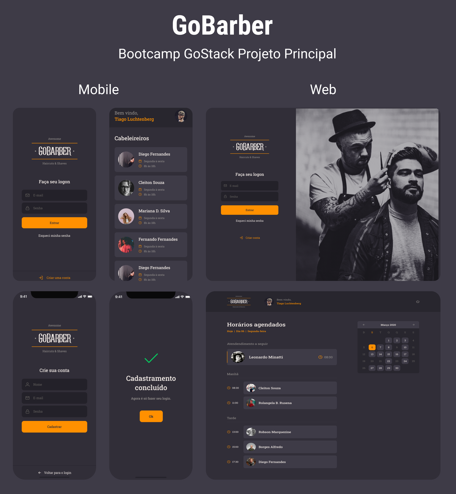

<div align="center">
  
</div>

<br>
<br>

<div align="center">
   <a href="www.linkedin.com/in/eloilsondosanjosrocha">
      
   </a>
  

  <a href="https://github.com/eloilsondosanjos/Proffy/commits/master">
    
  </a>
  
  <a href="https://github.com/eloilsondosanjos/Proffy/stargazers">
    
  </a>
</div>

<br>

## 🎯 Indice

  - [Tecnologias](#-tecnologias)
  - [Como Baixar e Executar os Projetos](#-como-baixar-e-executar-os-projetos)
  - [Layout](#-layout)
  - [Licença](#-licença)

</div>

<br>

## 💻 O que é o GoBarber

<br>

É uma aplicação completa voltada a prestação de serviços em barbearia. Desenvolvida com as tenologias mais mordernas do mercado foi criada no bootcamp GoStack 2020 edição 12, como principal ferramenta de estudo na praticar, fixando com maior velocidade os conceitos aprendidos no decorrer de toda a jornada focando sempre em alcançar o próximo nível.

<br>

## 🚀 Tecnologias

### Front-end WEB:

- [ReactJS](https://pt-br.reactjs.org)
- [Axios](https://github.com/axios/axios)
- [Styled-components](https://styled-components.com)
- [TypeScript](https://www.typescriptlang.org)
- [Yup](https://github.com/jquense/yup)
- [Uuidv4](https://github.com/thenativeweb/uuidv4)
- [Date-fns](https://date-fns.org/docs/Getting-Started)
- [@unform/core](https://www.npmjs.com/package/@unform/core)
- [@unform/web](https://www.npmjs.com/package/@unform/web)


### Front-end Mobile:

- [React Native](https://reactnative.dev/)
- [Axios](https://github.com/axios/axios)
- [Styled-components](https://styled-components.com)
- [TypeScript](https://www.typescriptlang.org)
- [@unform/mobile](https://www.npmjs.com/package/@unform/mobile)
- [Yup](https://github.com/jquense/yup)
- [Date-fns](https://date-fns.org/docs/Getting-Started)

### Back-end:

- [NodeJS](https://nodejs.org/en)
- [Express](https://expressjs.com)
- [Multer](https://www.npmjs.com/package/multer)
- [Date-fns](https://date-fns.org/docs/Getting-Started)
- [Docker](https://www.docker.com/)
- [TypeORM](https://typeorm.io/#/)
- [PostgreSQL](https://www.postgresql.org/)
- [Redis](https://redis.io/)
- [MongoDB](https://www.mongodb.com/)
- [Nodemailer](https://nodemailer.com/about/)
- [Uuidv4](https://github.com/thenativeweb/uuidv4)
- [Bcryptjs](https://www.npmjs.com/package/bcryptjs)
- [Celebrate](https://github.com/arb/celebrate)
- [Class-transformer](https://github.com/typestack/class-transformer)
- [TSyringe](https://github.com/microsoft/tsyringe)
- [Reflect-metadata](https://www.npmjs.com/package/reflect-metadata)
- [Handlebars](https://handlebarsjs.com/guide/#what-is-handlebars)
- [Cors](https://www.npmjs.com/package/cors)
- [Dotenv](https://www.npmjs.com/package/dotenv)
- [Jsonwebtoken](https://www.npmjs.com/package/jsonwebtoken)
 
 <br>

## 📦 Como Baixar e Executar os Projetos
<br>

```bash

  # Para clonar o repositório para seu computador

  $ git clone https://github.com/eloilsondosanjos/GoBarber.git

```
<br>

- Para Executar Front-end WEB:

```bash
  # Entrar na pasta do projeto web

  $ cd web

  # Para instalar todas as dependências do projeto web

  $ yarn

  # Para iniciar a aplicação na porta: 3000

  $ yarn start

```
<br>

- Para Executar Front-end Mobile:

```bash

  # Entrar na pasta do projeto app

  $ cd app

  # Para instalar todas as dependências do projeto mobile

  $ yarn

  # Para iniciar a aplicação no emulador ou dispositivo físico

  # Em abiente Android: 

  $ yarn android

  # Em abiente iOS: 

  $ yarn ios

```

## 🚦 Importante:

Siga os passos a seguir para [Configurar Ambiente React Native](https://react-native.rocketseat.dev/)

<br>

- Para Executar Back-end API:

```bash

  # Entrar na pasta do projeto api

  $ cd api

  # Para instalar todas as dependências do projeto API

  $ yarn

  # Para iniciar a aplicação na porta: 3333

  $ yarn dev:server

```


## 📟 Layout

Você pode ver o layout detalhado através do figma. [nesse link](https://www.figma.com/file/psKKcUo49oiBinJG5zB8Zu/GoBarber?node-id=57%3A517)

<br>

## 📋 Licença

Esse projeto está sob a licença MIT. Veja o arquivo [LICENSE](LICENSE.htm) para mais detalhes.

<br>

---

🚀🚀🚀 Desenvolvido por Eloilson dos Anjos 🚀🚀🚀
